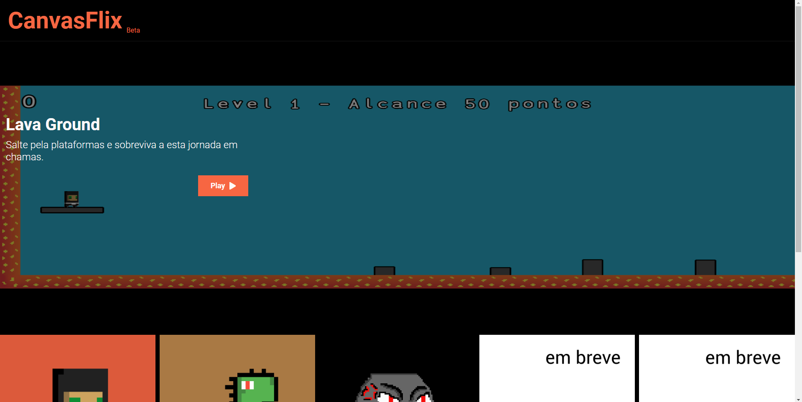
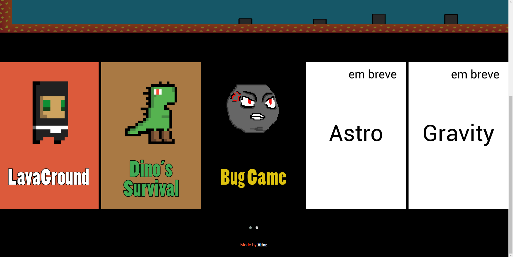
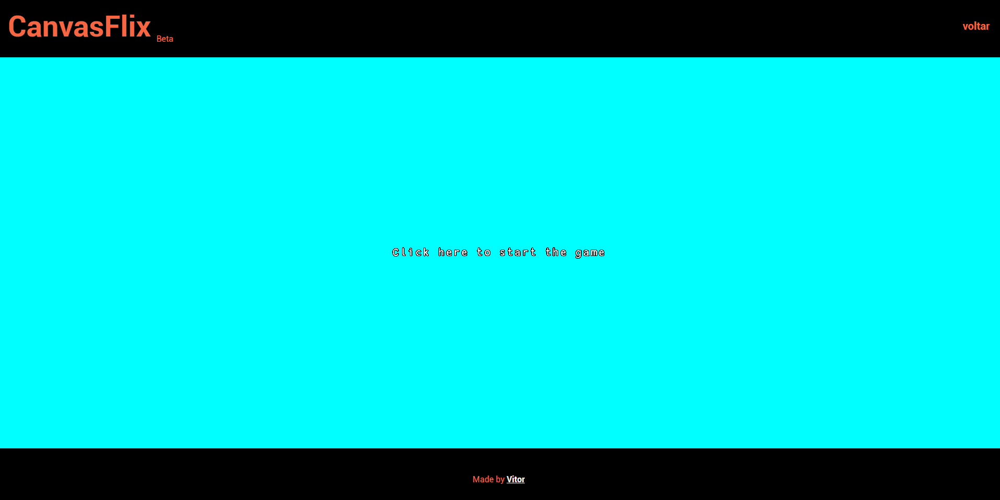
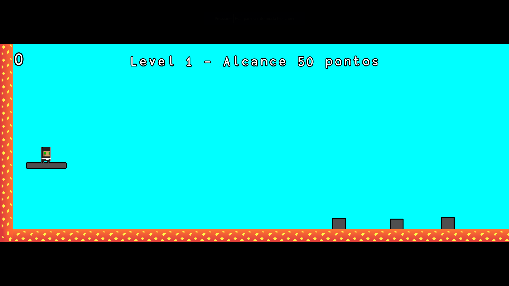
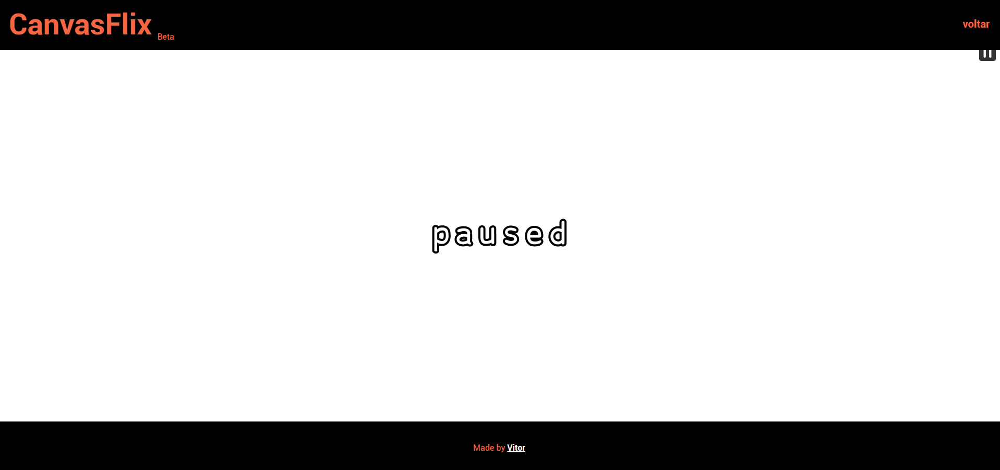
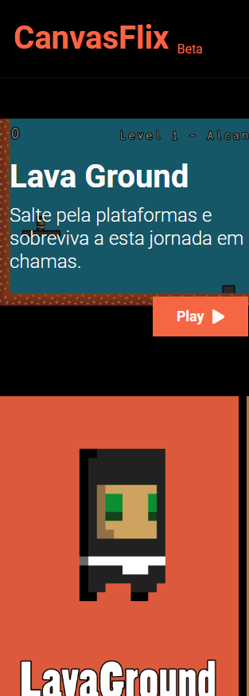
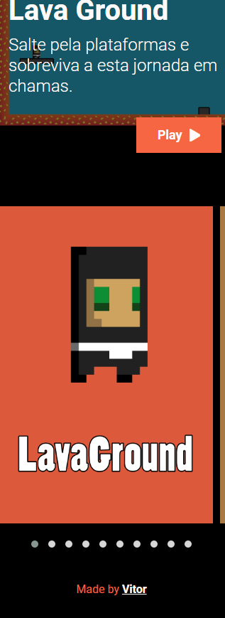

# CanvasFlix

Uma plataforma de jogos com canvas  desenvolvidos com a biblioteca kaboom js.

    

## SUMÁRIO

- Status
- Deploy
- Features
- Demonstração da Aplicação
- Como Rodar a Aplicação
- Pré Requisitos Para Rodar a Aplicação
- Tecnologias utilizadas
- Autor

## Status

Updates futuros serão feitos...

## Deploy

- [https://vitor-mat.github.io/CanvasFlix/](https://vitor-mat.github.io/CanvasFlix/)

## Features

- Diversos jogos
- Site responsivo
- Carousel com jquery

## Demonstração da Aplicação

### CanvasFlix Desktop 1

### CanvasFlix Desktop 2

### CanvasFlix Desktop 3

### CanvasFlix Desktop 4

### CanvasFlix Desktop 5

### portifolio Mobile 1

### portifolio Mobile 2

### portifolio Mobile 3

## Pré Requisitos Para Rodar a Aplicação

Você precisa simplesmente de um browser de internet e um servidor para rodar o codigo dos jogos.

## Como Rodar a Aplicação

A home pode ser aberta diretamente no navegador, mas os jogos precisarão de ser servidos por um servidor, como o localhost, você pode usar um servidor node ou o live server do visual code que foram os que utilizei.

## Tecnologias Utilizadas

- [html](https://developer.mozilla.org/pt-BR/docs/Web/HTML)
- [css](https://developer.mozilla.org/pt-BR/docs/Web/CSS)
- [javscript](https://developer.mozilla.org/pt-BR/docs/Web/JavaScript)
- [kaboomjs](https://kaboomjs.com/#kaboom)

## Autor

Feito por Vitor Mateus

 

